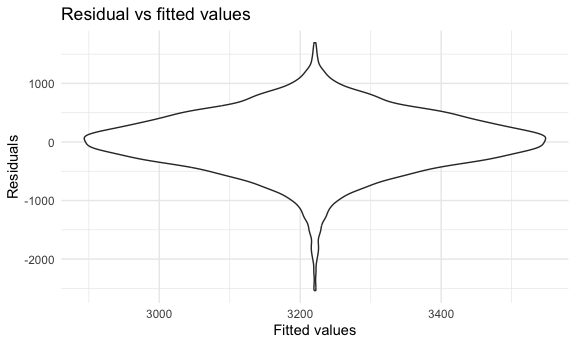
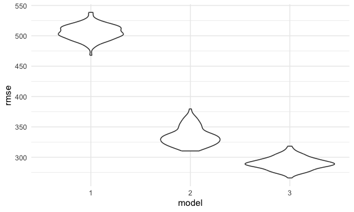

P8105 Homework 6
================
Diana Hernandez
2023-12-02

Load libraries and settings.

``` r
library(tidyverse)
```

    ## ── Attaching core tidyverse packages ──────────────────────── tidyverse 2.0.0 ──
    ## ✔ dplyr     1.1.3     ✔ readr     2.1.4
    ## ✔ forcats   1.0.0     ✔ stringr   1.5.0
    ## ✔ ggplot2   3.4.3     ✔ tibble    3.2.1
    ## ✔ lubridate 1.9.2     ✔ tidyr     1.3.0
    ## ✔ purrr     1.0.2     
    ## ── Conflicts ────────────────────────────────────────── tidyverse_conflicts() ──
    ## ✖ dplyr::filter() masks stats::filter()
    ## ✖ dplyr::lag()    masks stats::lag()
    ## ℹ Use the conflicted package (<http://conflicted.r-lib.org/>) to force all conflicts to become errors

``` r
library(modelr)
library(mgcv)
```

    ## Loading required package: nlme
    ## 
    ## Attaching package: 'nlme'
    ## 
    ## The following object is masked from 'package:dplyr':
    ## 
    ##     collapse
    ## 
    ## This is mgcv 1.9-0. For overview type 'help("mgcv-package")'.

``` r
set.seed(1)

knitr::opts_chunk$set(
  fig.width = 6,
  fig.asp = .6,
  out.width = "90%"
)

theme_set(theme_minimal())

options(
  ggplot2.continuous.colour = "viridis",
  ggplot2.continuous.fill = "viridis"
)

scale_colour_discrete = scale_colour_viridis_d
scale_fill_discrete = scale_fill_viridis_d
```

# Problem 1

Import dataset.

``` r
homicide_data =
  read_csv("https://raw.githubusercontent.com/washingtonpost/data-homicides/master/homicide-data.csv")
```

    ## Rows: 52179 Columns: 12
    ## ── Column specification ────────────────────────────────────────────────────────
    ## Delimiter: ","
    ## chr (9): uid, victim_last, victim_first, victim_race, victim_age, victim_sex...
    ## dbl (3): reported_date, lat, lon
    ## 
    ## ℹ Use `spec()` to retrieve the full column specification for this data.
    ## ℹ Specify the column types or set `show_col_types = FALSE` to quiet this message.

Create `city_state` variable and binary variable indicating whether the
homicide is solved.

``` r
homicide_tidy = 
  homicide_data |>
  mutate(
    city_state = str_c(city, state, sep = ", "),
    resolution = case_when(
      disposition == "Closed without arrest" ~ "unsolved",
      disposition == "Open/No arrest"        ~ "unsolved",
      disposition == "Closed by arrest"      ~ "solved"
    ),
    victim_age = as.numeric(victim_age)
  ) |>
  filter(
    !city_state %in% c("Tulsa, AL", "Dallas, TX", "Phoenix, AZ", "Kansas City, MO"),
    victim_race %in% c("White", "Black")) 
```

    ## Warning: There was 1 warning in `mutate()`.
    ## ℹ In argument: `victim_age = as.numeric(victim_age)`.
    ## Caused by warning:
    ## ! NAs introduced by coercion

For the city of Baltimore, MD, use the `glm` function to fit a logistic
regression with resolved vs unresolved as the outcome and victim age,
sex and race as predictors.

``` r
baltimore_df =
  homicide_tidy |>
  filter(city_state == "Baltimore, MD") |>
  mutate(
    resolution = as.numeric(resolution == "unsolved")
  )

baltimore_fit_logistic =
  baltimore_df |>
  glm(resolution ~ victim_age + victim_race + victim_sex, data = _, family = binomial()) 
```

Estimate and confidence interval of the adjusted odds ratio for solving
homicides comparing male victims to female victims keeping all other
variables fixed.

``` r
baltimore_fit_logistic |> 
  broom::tidy() |> 
  mutate(OR = exp(estimate)) |>
  select(term, log_OR = estimate, OR, p.value) |> 
  knitr::kable(digits = 3)
```

| term             | log_OR |    OR | p.value |
|:-----------------|-------:|------:|--------:|
| (Intercept)      | -0.310 | 0.733 |   0.070 |
| victim_age       |  0.007 | 1.007 |   0.043 |
| victim_raceWhite | -0.842 | 0.431 |   0.000 |
| victim_sexMale   |  0.854 | 2.350 |   0.000 |

Run `glm` for each of the cities in your dataset, and extract the
adjusted odds ratio (and CI) for solving homicides comparing male
victims to female victims.

# Problem 2

Import dataset.

``` r
weather_df = 
  rnoaa::meteo_pull_monitors(
    c("USW00094728"),
    var = c("PRCP", "TMIN", "TMAX"), 
    date_min = "2022-01-01",
    date_max = "2022-12-31") |>
  mutate(
    name = recode(id, USW00094728 = "CentralPark_NY"),
    tmin = tmin / 10,
    tmax = tmax / 10) |>
  select(name, id, everything())
```

    ## using cached file: /Users/dianahernandez/Library/Caches/org.R-project.R/R/rnoaa/noaa_ghcnd/USW00094728.dly

    ## date created (size, mb): 2023-09-28 10:50:50.364706 (8.524)

    ## file min/max dates: 1869-01-01 / 2023-09-30

Bootstrapping SLR with `tmax` as the response with `tmin` and `prcp` as
the predictors.

``` r
weather_df |> 
  modelr::bootstrap(n = 5000) |> 
  mutate(
    models = map(strap, \(df) lm(tmax ~ tmin + prcp, data = df)),
    results = map(models, broom::tidy),
    rsquared = map(models, broom::glance))|> 
  select(results, rsquared) |> 
  unnest(rsquared) |>
  select(results, r.squared) |>
  unnest(results) |>
  select(term, estimate, r.squared) |>
  mutate(term = as.factor(term)) |>
  pivot_wider(
    names_from = "term", 
    values_from = "estimate",
    names_prefix = "beta_") |>
  mutate(
    log_beta1beta2 = log(beta_tmin*beta_prcp)
  )
```

    ## Warning: There was 1 warning in `mutate()`.
    ## ℹ In argument: `log_beta1beta2 = log(beta_tmin * beta_prcp)`.
    ## Caused by warning in `log()`:
    ## ! NaNs produced

    ## # A tibble: 5,000 × 5
    ##    r.squared `beta_(Intercept)` beta_tmin beta_prcp log_beta1beta2
    ##        <dbl>              <dbl>     <dbl>     <dbl>          <dbl>
    ##  1     0.898               8.50     0.972  0.00449           -5.44
    ##  2     0.928               7.99     1.02  -0.00702          NaN   
    ##  3     0.925               8.10     1.03  -0.00776          NaN   
    ##  4     0.931               8.18     1.01  -0.00991          NaN   
    ##  5     0.915               8.21     1.01  -0.00364          NaN   
    ##  6     0.918               7.96     1.01   0.000755          -7.18
    ##  7     0.922               7.99     1.02  -0.00300          NaN   
    ##  8     0.910               7.67     1.04   0.00124           -6.65
    ##  9     0.910               8.03     1.01   0.00199           -6.21
    ## 10     0.939               7.99     1.02  -0.00621          NaN   
    ## # ℹ 4,990 more rows

# Problem 3

Import dataset.

``` r
birthweight = read_csv("./data/birthweight.csv")
```

    ## Rows: 4342 Columns: 20
    ## ── Column specification ────────────────────────────────────────────────────────
    ## Delimiter: ","
    ## dbl (20): babysex, bhead, blength, bwt, delwt, fincome, frace, gaweeks, malf...
    ## 
    ## ℹ Use `spec()` to retrieve the full column specification for this data.
    ## ℹ Specify the column types or set `show_col_types = FALSE` to quiet this message.

Data wrangling of `birthweight` dataset.

Models

Model 1: One using mother’s age at delivery (in years) and average
number of cigarettes smoked per day during pregnancy as predictors (main
effects only). This model is based on factors that underlie birth
weight.

``` r
model1_fit = lm(bwt ~ momage + smoken, data = birthweight) 

birthweight |> 
  select(bwt, momage, smoken) |>
  modelr::add_residuals(model1_fit) |> 
  modelr::add_predictions(model1_fit) |>
  ggplot(aes(x = pred, y = resid)) +
  geom_violin() +
  labs(
    title = "Residual vs fitted values",
    x = "Fitted values",
    y = "Residuals"
  )
```



Model 2: One using length at birth and gestational age as predictors
(main effects only).

``` r
model2_fit = 
  lm(bwt ~ blength + gaweeks, data = birthweight)
```

Model 3: One using head circumference, length, sex, and all interactions
(including the three-way interaction) between these.

``` r
model3_fit = 
  lm(bwt ~ bhead + blength + babysex + bhead*blength*babysex, data = birthweight) 
```

Compare models using cross-validated prediction error.

``` r
cv_df =
  crossv_mc(birthweight, 100) |>
  mutate(
    train = map(train, as_tibble),
    test = map(test, as_tibble))
```

Use mutate + map & map2 to fit models to training data and obtain
corresponding RMSEs for the testing data.

``` r
cv_df = 
  cv_df |> 
  mutate(
    model1 = map(train, \(df) lm(bwt ~ momage + smoken, data = df)),
    model2 = map(train, \(df) lm(bwt ~ blength + gaweeks, data = df)),
    model3 = map(train, \(df) lm(bwt ~ bhead + blength + babysex + bhead*blength*babysex, data = df))) |> 
  mutate(
    rmse_1 = map2_dbl(model1, test, \(mod, df) rmse(model = mod, data = df)),
    rmse_2 = map2_dbl(model2, test, \(mod, df) rmse(model = mod, data = df)),
    rmse_3 = map2_dbl(model3, test, \(mod, df) rmse(model = mod, data = df)))
```

Plot the prediction error distribution for each candidate model.

``` r
cv_df |> 
  select(starts_with("rmse")) |> 
  pivot_longer(
    everything(),
    names_to = "model", 
    values_to = "rmse",
    names_prefix = "rmse_") |> 
  mutate(model = fct_inorder(model)) |> 
  ggplot(aes(x = model, y = rmse)) + geom_violin()
```



Based on these results, Model 1 is not optimal despite taking account
factors that underlie birthweight. Model 3 is the most optimal. The
lower the RMSE, the better the model is.
